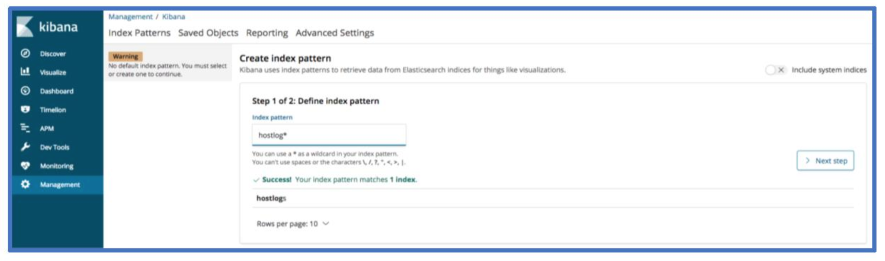
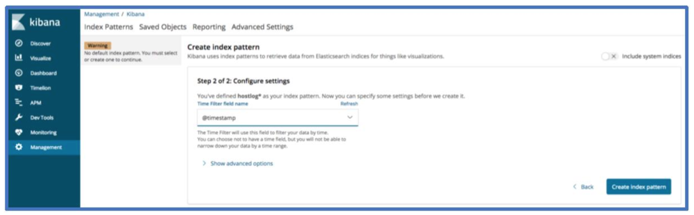
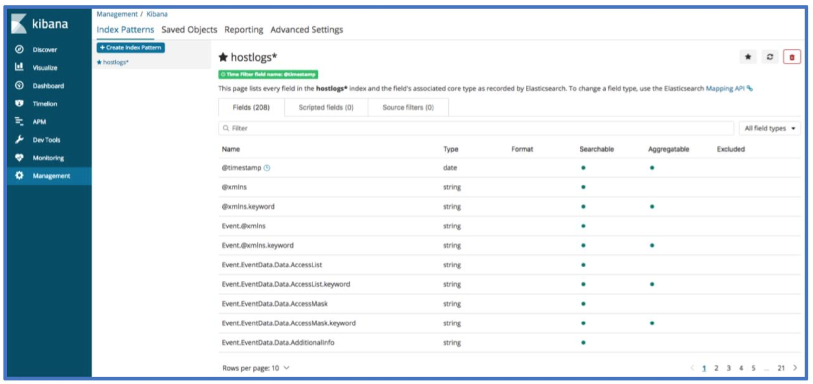
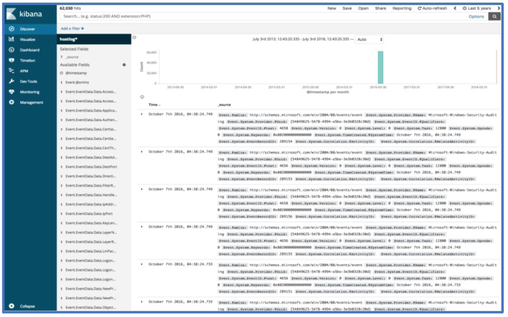
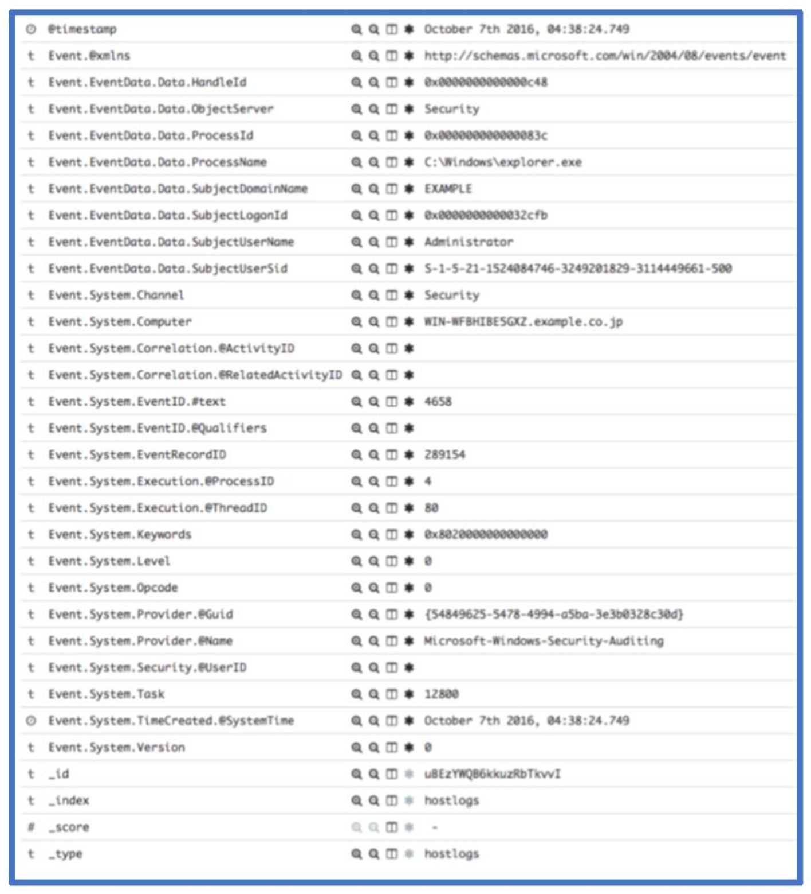
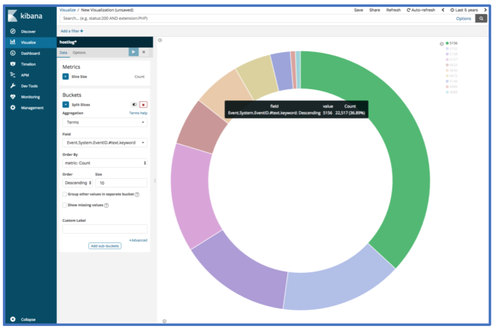

# EvtxToElk: A Python Module to Load Windows Event Logs into ElasticSearch

> **About this copy.** This post was first published on the Dragos blog on
> 17 July 2018 at
> `https://www.dragos.com/blog/industry-news/evtxtoelk-a-python-module-to-load-windows-event-logs-into-elasticsearch/`.
> Dragos has since removed it; the text and screenshots below were recovered
> from the
> [Wayback Machine snapshot of 12 August 2025](https://web.archive.org/web/20250812132436/https://www.dragos.com/blog/industry-news/evtxtoelk-a-python-module-to-load-windows-event-logs-into-elasticsearch/)
> and are reproduced here by the author. The body is unchanged apart from
> formatting.
>
> The commands and code in the post refer to the original 1.x release, a single
> `evtxtoelk.py` script driven from the Python interpreter. Version 2.0 is a
> package with a command-line tool, `evtxtoelk FILE... URL`, and targets
> Elasticsearch 8 and 9. Where the post shows a 1.x command, a *2.0 note* gives
> the current equivalent; see the [README](../README.md) for the full option
> list.

By: Dan Gunter & Marc Seitz

## Motivation

Problem:

On a recent threat hunt, we found ourselves in a position out in the field at
a place with limited internet bandwidth and only our laptops for approved
hardware resources for data. One of the datasets supplied for the engagement
comprised of 5-6 GB of Windows Event Logs stored as .evtx files. There are
several tools out there for streaming Windows Event Logs to a destination, but
we were limited to offline use of this dataset. We needed a way to sort through
and run analytics across the information in an efficient and swift manner. Due
to the size of the collection, we immediately ruled out manual analysis of the
Windows Event Logs.

Solution:

Ultimately, we wrote a Python module named EvtxToElk. This module does what
the name implies: ingests evtx files into an ELK stack. In our scenario, we
ingested Windows Event Logs evtx files into a fresh ELK stack running locally,
making analysis efficient and effective. Today we are open-sourcing this Python
module to add another tool into the broader information security community
toolbox to find attackers.

Python package information: <https://pypi.org/project/evtxtoelk/>

Source code: <https://github.com/dgunter/evtxtoelk>

## Design

Before today, there was no module taking evtx files the full distance from
file to indexed in the ELK stack. However, in true Python nature, we harnessed
the capabilities of three different Python modules and added additional logic
to create the output we required.

- Willi Ballenthin (@williballenthin) previously wrote an excellent Python
  module named python-evtx.
  - Function used: Creates XML files from Windows Event Log files stored as
    evtx files
- Martin Blech wrote a module named xmltodict
  - Function used: transforms xml file to dict
- ElasticSearch Module
  - Function used: importing JSON files into ELK stack

Instead of re-inventing the wheel, we took the output of Willi Ballenthin's
tool and converted the XML to a Python dictionary. The ElasticSearch module
requires changing the dictionary into a JSON string. Our module combines all
three modules and adds the needed data normalization between module output for
data records to then be loaded into ELK using the ElasticSearch module. Some
logic did have to be written to get the dictionary data into an ELK-friendly
format. If you look at the source code, most lines of code involved
restructuring the JSON data to meet ELK storage constraints.

## Windows Event Log Format Progression


## Start to Finish

**Step 0: Create an ElasticSearch and Kibana Instance**

We ended up using a Docker container by running the following command:

```bash
docker run -p 9200:9200 -p 9300:9300 -p 5601:5601 sebp/elk
```

The command above will run Sébastien Pujadas's (spujadas) ELK Docker container
from the Docker Hub that includes Elasticsearch, Logstash, and Kibana. Docker
run will download the ELK image if you haven't previously done so. You can
confirm that the ELK stack is running by visiting:

- <http://localhost:5601>

> **2.0 note.** The `sebp/elk` image dates from the Elasticsearch 6 era. The
> repository now ships a `docker-compose.yml` that starts a single-node
> Elasticsearch 9 on `localhost:9200` for development and integration tests:
>
> ```bash
> docker compose up -d --wait
> ```
>
> It does not include Kibana; add a Kibana container of the same major version
> if you want to follow the Kibana steps below.

**Step 1: Install EvtxToElk Python Module**

The Python Package Index (PyPi) hosts the EvtxToElk package. To download with
PIP, use the following command:

```bash
python3 -m pip install evtxtoelk
```

You can also use:

```bash
pip install evtxtoelk
```

> **2.0 note.** Installation is unchanged. Version 2.0 requires Python 3.10 or
> newer; from a checkout, `uv sync` creates the environment.

**Step 2: Load Windows Event Logs into ELK**

Loading an event log is as simple as opening the Python interpreter and
running these two lines of Python code:

```python
from evtxtoelk import EvtxToElk
EvtxToElk.evtx_to_elk("Security.evtx", "http://localhost:9200")
```

The first parameter is the path to the event log file you want to load and the
second is the connection string to the Kibana instance you are using. We used
the security.evtx file from JPCERTCC's LogonTracer github repo here:

- <https://github.com/JPCERTCC/LogonTracer/blob/master/sample/Security.evtx>

> **2.0 note.** The same load is now a shell command. `--create-index` creates
> the index with the recommended mapping if it does not already exist, and
> several files can be given at once:
>
> ```bash
> evtxtoelk Security.evtx http://localhost:9200 --create-index
> ```
>
> To tag every document with case metadata, pass a JSON object with `-m`:
>
> ```bash
> evtxtoelk Security.evtx http://localhost:9200 --create-index -m '{"case": "1234", "host": "WKS01"}'
> ```
>
> The 1.x call `EvtxToElk.evtx_to_elk("Security.evtx", "http://localhost:9200")`
> still works from the interpreter and returns a `LoadResult`. The second
> argument is the Elasticsearch URL, not Kibana, in both versions.

**Step 3: Configure Kibana Index**

If you've completed the steps successfully up to this point, you should now
have log data in your Kibana instance. To view data in Kibana, you will need to
set up an index pattern. Currently, all data saves into an index named hostlog
and a doc_type named hostlog. The index will be configurable in an upcoming
version. In the index pattern field, you should use hostlog*.

> **2.0 note.** The default index is `hostlogs` and can be changed with
> `-i`/`--index`. Document types were removed in Elasticsearch 8, so there is
> no `doc_type`. Recent Kibana releases call index patterns *data views*; use
> `hostlogs*` there.





Now select @timestamp for the time filter field name and click create index
pattern.

Your Kibana index screen should now look something like the image below.



**Step 4: Confirm Presence of Data**

You should now be able to view host log data with the discover page. If you
are not seeing any data, check that the time range in the top right corner of
Kibana includes the time range you expect to see data in.



## Moving Forward

Congrats! You've now loaded Windows Event Log data into ELK! A lot of the
threat hunts and incident response cases we've worked lately relied on the
above approach and use of Kibana's visualization features. Here's an overview
of a few fields to get started. The screenshot below shows the first record.



The Event.System.EventID.#text field is the event ID associated with a given
record. Event 4658 shown above logs a handle to an object being closed. We can
see the owning process, owning user and domain as well as other system
information associated with this event. If you need a reference for a given
windows event record, we recommend Randy Smith's Ultimate Windows Security
site. For this event, the relevant page is:
<https://www.ultimatewindowssecurity.com/securitylog/encyclopedia/event.aspx?eventid=4658>.

If we wanted to see what the top 10 event log IDs within the loaded event logs
are, we can use the following visualization. The count can be viewed by
hovering over one of the segments of the pie chart.



When we start a threat hunt with new data sets, we often use a set of saved
queries and visualizations to provide a quick glance into commonly analyzed
areas. The initial glance offers an initial assessment of where to allocate
during a new engagement. The saved queries and visualizations also allow
analysis across large sets of data and the ability to use Jupyter Notebooks to
search across the data.

## Conclusion

EvtxToElk takes previously-captured Windows Event Logs and runs the data
through all formatting and normalization required to be indexed in ELK. The
ability to work with Windows Event Logs in ELK greatly increases efficiency of
analysis and cannot be overstated. Of course, this is just one way to solve a
problem we encountered. Let us know if there are other modules you would like
to see!

Hopefully, this helps get analysis rolling. Feel free to reach out to us on
Twitter ([@Dan_Gunter](https://twitter.com/dan_gunter),
[@SubtleThreat](https://twitter.com/subtlethreat)) if you have any questions,
ideas or comments.
